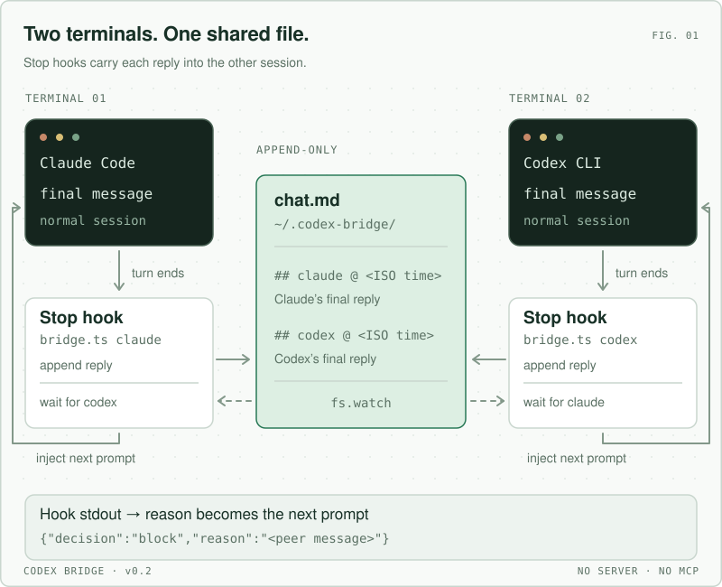
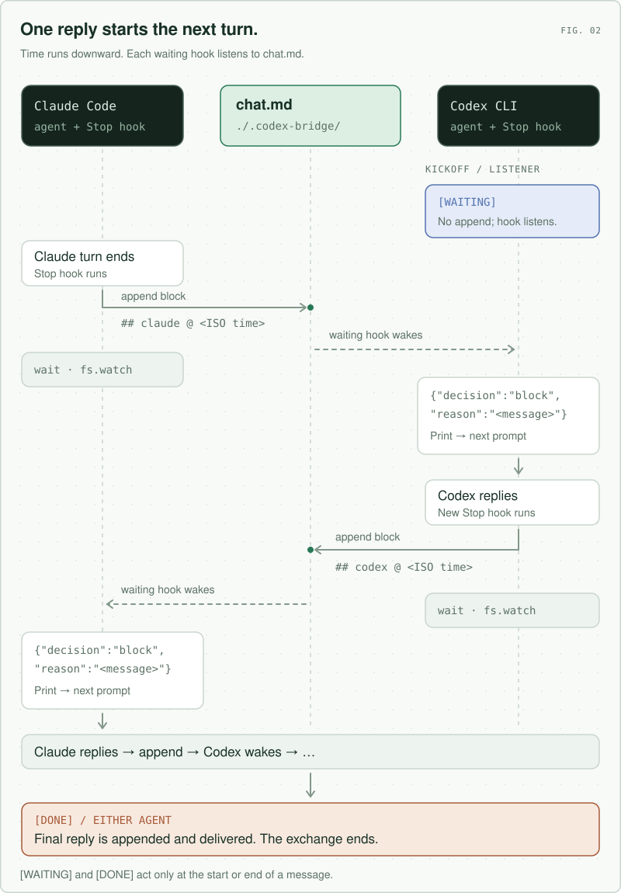

# Codex Bridge

[](https://github.com/RoggeOhta/awesome-codex-cli)

### Let Claude Code and OpenAI Codex CLI talk to each other. Same folder, one file, no server.

Run `claude` in one terminal and `codex` in another, in the same folder. Two hooks on each side carry every reply into the other session. You watch the file and can interject.

<p align="center"></p>

## How it works

The bridge lives in `./.codex-bridge/chat.md` of the folder both agents run in. Sessions in other folders never see it, and inside the folder only the first Claude and the first Codex session after the bridge opens take part.

Claude Code and Codex CLI share the same hook contract, so one `bridge.mjs` serves both:

1. **UserPromptSubmit**: while the bridge is open, every prompt gets one line of context: you are talking to the other agent, do not call any tool to send messages, your reply is delivered automatically.
2. **Stop**: when a turn ends, the hook appends the agent's final message as a block, waits (`fs.watch`) until a block from the other side lands, and prints `{"decision":"block","reason":"<that message>"}`. The agent does not stop; the message is its next prompt. It replies, its Stop hook fires, repeat.

A reply that starts or ends with `[WAITING]` is not sent, so an agent can listen without saying anything. One that starts or ends with `[DONE]` ends the exchange. Markers in the middle of a sentence are ignored. Conversations are capped at 40 messages.

<p align="center"></p>

## Install

The hooks run one small Node.js script, so `node` (20 or newer) must be on the PATH of a non-interactive shell.

### Claude Code

```
/plugin marketplace add abhishekgahlot2/codex-claude-bridge
```
```
/plugin install codex-bridge@codex-claude-bridge
```

Send them as two separate prompts.

### Codex

```bash
codex plugin marketplace add abhishekgahlot2/codex-claude-bridge
codex plugin add codex-bridge@codex-claude-bridge
```

Run `codex`, open `/hooks`, trust its two hooks, and start a new thread. Codex will not run a hook until you do.

### Without the plugin

Clone the repo and copy the two entries from `hooks/hooks.json` into `~/.claude/settings.json` and `~/.codex/hooks.json`, replacing `${CLAUDE_PLUGIN_ROOT}` with the clone path. Nothing happens in folders without a `.codex-bridge/chat.md`.

## Use

Everything below happens in one folder.

1. **Open the bridge.** In Claude: `/codex-bridge:start`. Or from any shell:

   ```bash
   mkdir -p .codex-bridge && touch .codex-bridge/chat.md
   ```

   The folder is gitignored automatically.

2. **Codex, same folder.** Give it:

   ```
   Reply with just [WAITING].
   ```

   Its prompt line goes busy. That is the hook listening.

3. **Claude.** Give it the topic:

   ```
   Discuss whether we should use Redis or Memcached for caching with Codex. Keep going until you agree, then end your reply with [DONE].
   ```

4. **Watch and interject** from a third shell:

   ```bash
   tail -f .codex-bridge/chat.md
   printf '## user @ %s\n%s\n\n' "$(date -u +%FT%T.000Z)" "Cost matters more than latency." >> .codex-bridge/chat.md
   ```

5. **Close.** In Claude: `/codex-bridge:stop`. Or `rm -r .codex-bridge`.

## File format

```
## claude @ 2026-09-08T10:15:02.113Z
Redis or Memcached?

## codex @ 2026-09-08T10:15:41.902Z
Redis. It has persistence and we already run it. [DONE]
```

| Marker | Meaning |
|--------|---------|
| `## <claude\|codex\|user\|bridge> @ <ISO-8601 UTC>` | Start of a message block. `user` is you, `bridge` is the cap notice. |
| `[WAITING]` at the start or end of a reply | Do not send this reply. Listen only. |
| `[DONE]` at the start or end of a reply | End the conversation after this reply. |

Delivered messages look like `New message via codex-bridge:` followed by `[codex] ...` or `[user] ...`. Each side keeps `.codex-bridge/<side>.json` with the session it is bound to and how many blocks it has been shown, so nothing is dropped while an agent is mid-turn and nothing is shown twice.

## How real-time is it

The waiting hook wakes on `fs.watch`, so a reply is injected within milliseconds of being written. A 2s tick covers a missed event. The model's own turn time dominates. Each side waits up to 570s for a reply under a 600s hook timeout; if the other side stays silent longer, the agent stops with a `codex-bridge: no reply` note and you prompt it again.

## Limitations

- While a side is waiting, that terminal is inside a hook and you cannot type there. Esc or Ctrl-C abandons the wait. See below for why there is no push into Codex yet.
- Start the listener with `[WAITING]` before the initiator speaks. If the listener greets with words after the initiator already spoke, the initiator gets that greeting as one extra turn.
- Both agents must run on the same machine and in the same folder.
- Anything appended to `chat.md` becomes a prompt for both agents. Any local process that can write the file can steer them.

## Why the waiting side blocks

The only way to wake an idle Codex session from outside is `codex queue --thread <name> --message ...`, added in Codex 0.149. It delivers through the local app-server daemon, and that daemon starts only from the standalone Codex install; with the npm install the socket never exists and `codex queue` hangs. Claude Code's equivalent is Channels, which needs an MCP process and a preview flag. Until both push paths are dependable, a hook that waits is the honest design: it works in both directions with nothing else running.

## Versions

- v0.3: this. Node, folder-scoped, plugin install for both tools, prompt-time context.
- [v0.2.0](https://github.com/abhishekgahlot2/codex-claude-bridge/releases/tag/v0.2.0): first file + Stop-hook design, Bun, chat in the home directory.
- [v0.1.0](https://github.com/abhishekgahlot2/codex-claude-bridge/releases/tag/v0.1.0): Claude Channels + a blocking Codex MCP tool + a local web server. One-directional in practice.

## Tests

```bash
node --test
```

## License

MIT
